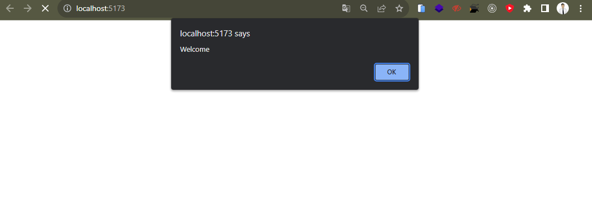
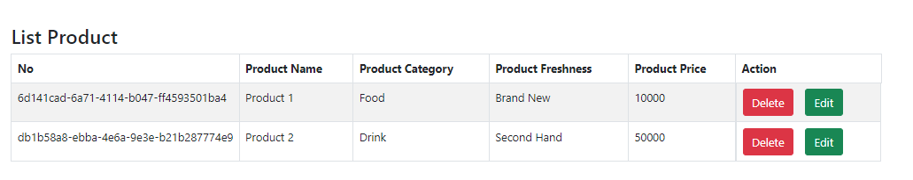
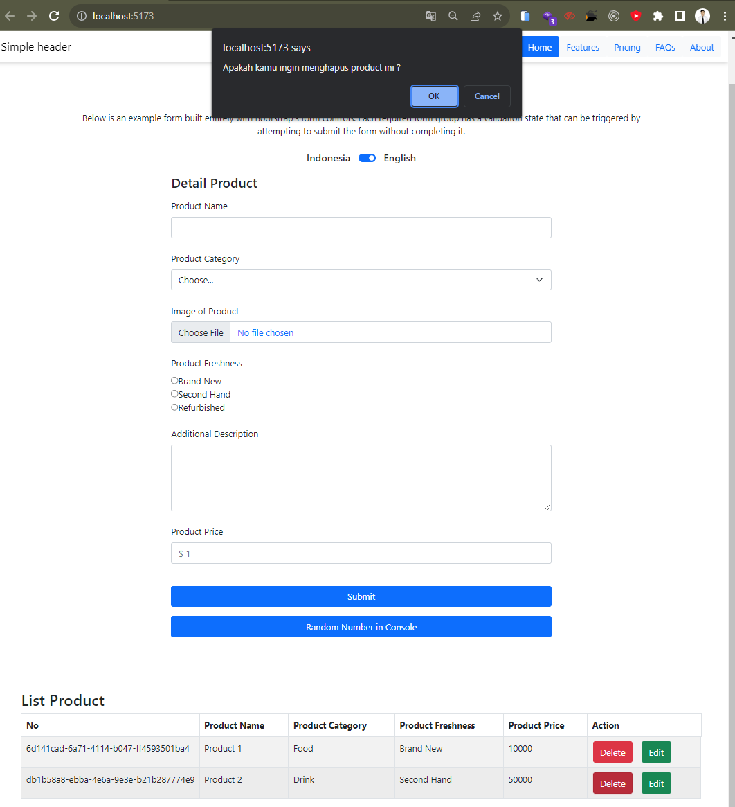
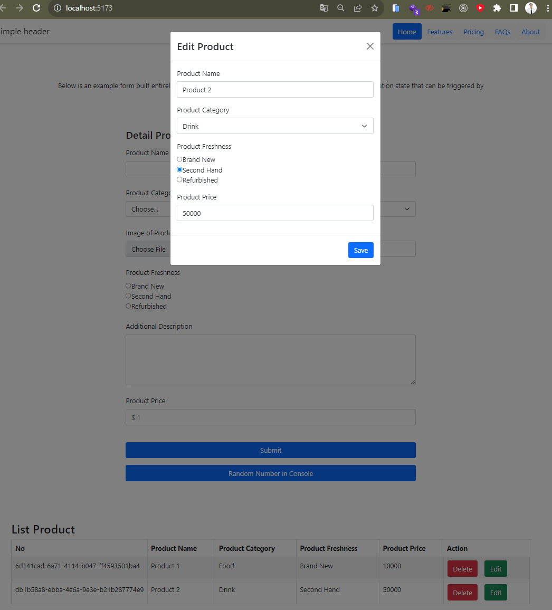

## Soal Prioritas 1 (80)

- Dengan menggunakan `useEffect` buatlah sebuah alert yang bertulisan `“Welcome”` ketika mereka membuka halaman `CreateAccount`. 

 

- Dengan menggunakan `UseState` masukkan setiap data yang kalian isi pada halaman `CreateProduct` ke dalam tabel. data yang akan tampil hanya no,Product Name, Product Category, Product Feshness dan Product Price. data yang lain tidak di tampilkan pada user interface. ilustrasi tabel dapat dilihat pada gambar di bawah 

 

- Nomor dibuat random menggunakan UUID atau sejenisnya. pastikan tidak ada duplikasi nomor. 

 

- Result Screenshot :

 

## Soal Prioritas 2 (20)

- buatlah tombol delete berfungsi, pastikan ketika ingin melakukan delete terdapat alert/modal/notifikasi yang bertuliskan apakah kalian ingin menghapus.
    - jika pilih hapus maka data baru akan terhapus.
    - jika pilih tidak maka alert/modal/notifikasi akan hilang.

 

- Result Screenshot :

## Soal Explorasi (20)

- buatlah fitur edit berfugsi, kalian bebas menggunakan hook, library atau hal lain sesuai keinginan kalian.
- flow untuk melakukan edit tidak di tentukan, yang terpenting adalah kalian dapat melakukan edit data

 

- Result Screenshot :

