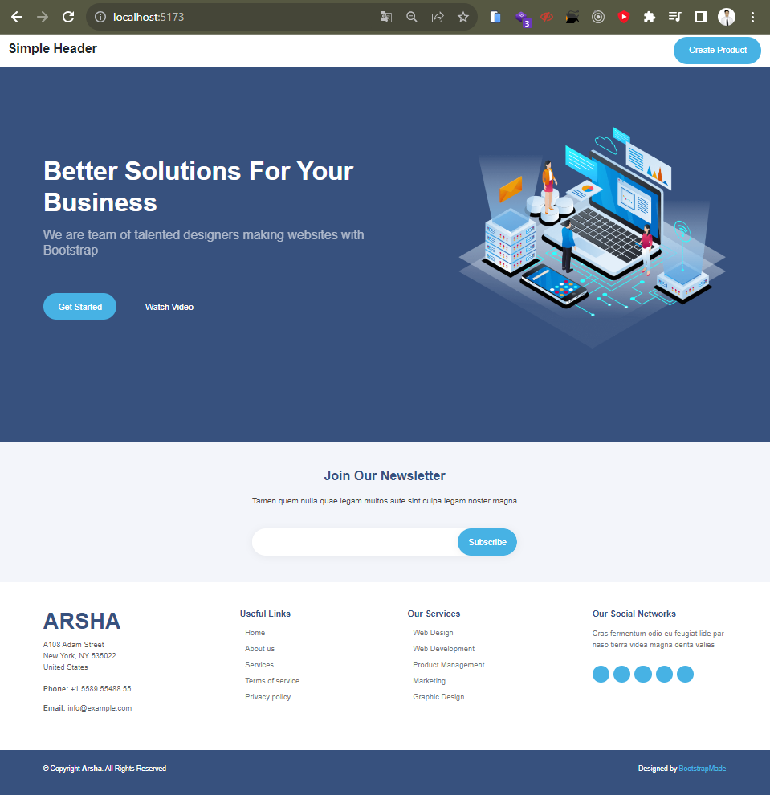
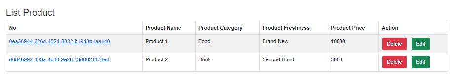
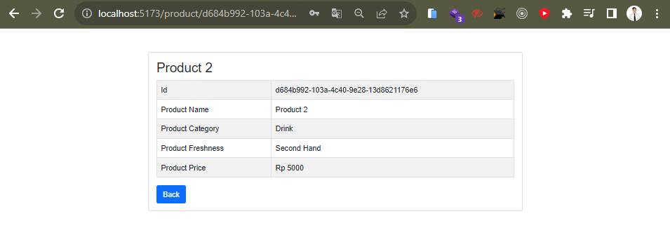
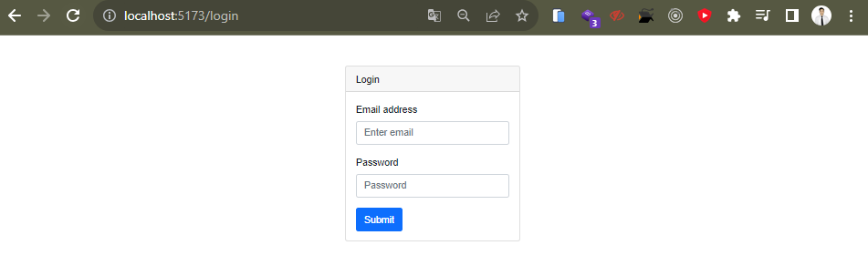

## Soal Prioritas 1 (80)

- Buatlah halaman `LandingPage` berdasarkan `LandingPage.html` yang telah kalian buat pada tugas sebelumnya

<br>

- Tambahkan tombol pada komponen `LandingPage.jsx` untuk menavigasi ke komponen `CreateProduct.jsx` dan Gunakan React Routing untuk navigasi antara component `LandingPage.jsx` dan  `CreateProduct.jsx`

<br>

- Result Screenshot :<br>


<br>

## Soal Prioritas 2 (20)

- Dengan memanfaatkan react routing buatlah fitur ketika user melakukan klik salah satu data pada tabel maka akan masuk ke halaman lain dan memunculkan data tersebut secara lengkap.

<br>

- Contoh : ketika user melakukan klik pada nomor “1,001” maka halaman akan berganti ke routing baru “localhost/account/1,001”. pada halaman ini akan berisikan data lengkap dari user tersebut. User Interface tidak ditentukan

<br>

- Result Screenshot :<br>




## Soal Explorasi (20)

- Buatlah sebuah fitur private routing, sehingga hanya user yang sudah login yang bisa mengakses halaman-halaman tertentu.
- kalian dapat menggunakan localstorage atau variabel biasa sebagai parameter user tersebut sudah login atau belum. contoh kode

<br>

- Code Private Route :
    ```js
    import { useEffect } from 'react';
    import { useNavigate } from 'react-router-dom';

    export default function PrivateRoute({ isLogin, children }) {
    const navigate = useNavigate();

    useEffect(() => {
        if (!isLogin) {
        navigate('/login');
        }
    }, [isLogin, navigate]);

    return children;
    }
    ```

<br>

- Result Screenshot :<br>

