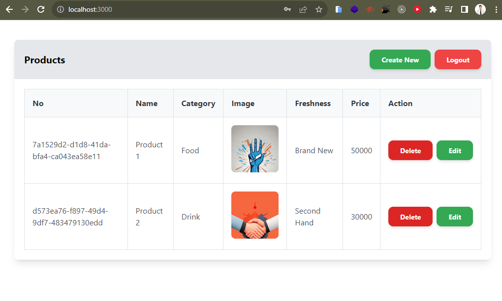

## Soal Prioritas 1 (80)

- regex validasi pada product name, product category, product freshness, product price yang telah kalian buat pada halaman CreateProduct

 

- Result Screenshot : 

 

## Soal Prioritas 2 (20)

- buatlah form image dan Product Freshness dapat berfungsi dan ketika user menggunakan form tersebut. datanya akan masuk ke dalam tabel. 

 

- buatlah validasi untuk Image dan Product Freshness sehingga data yang di masukkan valid. 

 

- Result Screenshot : 

## Soal Explorasi (20)

- Buat form registrasi pengguna yang meminta data **`first name`**, **`last name`**, **`username`**, **`email`**, **`password`**, dan **`confirm password`**. Gunakan library form tertentu (seperti Formik, Redux Form, dll.) dan pastikan validasi form yang diterapkan meliputi:
    - First name dan last name harus memiliki panjang minimal 3 karakter.
    - Email harus memiliki format email yang valid.
    - Password harus memiliki panjang minimal 8 karakter dan harus cocok dengan **`confirm password`**.

 

- Buat form login yang meminta data **`email`** dan **`password`**. Gunakan state dan event handlers untuk mengontrol input dan memvalidasi form, dengan validasi sebagai berikut:
    - Email harus memiliki format email yang valid.
    - Password harus memiliki panjang minimal 8 karakter.
    - Tampilkan pesan error jika salah satu dari kedua field tidak valid.

 

- Buatlah form register dan login menjadi sebuah halaman. Kemudian, buat sebuah routing sehingga user dapat berpindah-pindah halaman. Kalian bebas bereksperimen terkait flow, tata leta, dan user interface pada kedua halaman ini.

 

- Result Screenshot : 

