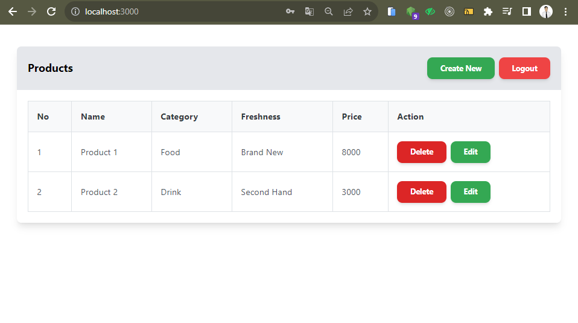
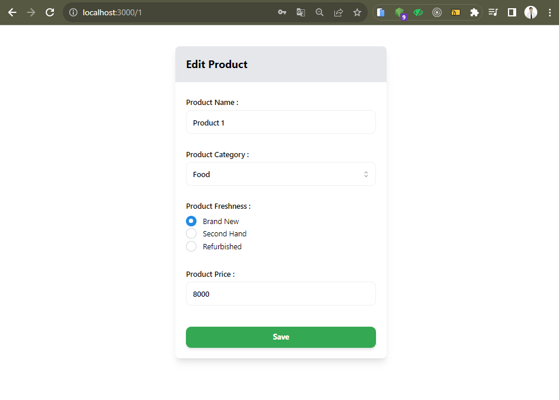
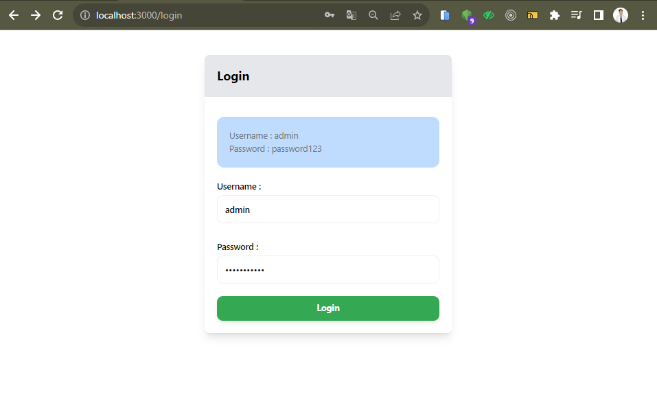

## Soal Introduction Restfull API

- Buat akun di `MockAPI` (https://mockapi.io/)
- Buat endpoint baru di `MockAPI` dengan spesifikasi minimal sebagai berikut:
    - Method: `GET`
    - URL: `/products`
    - Response: `JSON` array yang berisi daftar product
    - Skema `product` memiliki field yang sama seperti form input `CreateProduct.jsx`
- Tambahkan dependensi `axios` ke aplikasi ReactJS kalian
- Sambungkan data pada mockAPI ke List Product
- Gunakan `axios` untuk mengambil data dari endpoint `MockAPI` dan tampilkan daftar user tersebut di komponen/halaman `ListProduct.jsx` yang sudah anda buat untuk menampilkan List Product.

 

- Result Screenshot : 

 

## Soal Restfull API

- Pada data dari form input komponen `CreateProduct.jsx` yang sebelumnya disimpan kedalam `state` dan `LocalStorage`. Sekarang simpan data tersebuh ke Rest API yang sudah kalian buat dengan `MockAPI` menggunakan librrary `axios` dan dengan http method `POST` dan tampilkan pesan sukses jika berhasil menyimpan data.
- Buatlah fitur `update` data user dihalaman `ListProduct.jsx` dan `update` data product dari RestAPI yang sudah kalian buat dengan `MockAPI`. `Update` data product dengan mengirim request ke Rest API tersebut menggunakan library `axios` dengan http method `PUT` dan tampilkan pesan sukses diupdate jika berhasil mengupdate data.
- Buatlah fitur `delete` data product dihalaman `ListProduct.jsx`. Lakukan request ke server Rest API dengan `axios` ke `endpoint` untuk `delete` data dengan http method `DELETE` dan berikan pesan sukses `delete` jika berhasil menghapus data dari server Rest API.

 

- Result Screenshot : 

## Soal Authentication in React 

- buatlah Authentication dan Authorization dari project yang telah kalian buat sebelumnya. manfaatkan data dummy pada local storage untuk proses tersebut. contoh kode sebagai berikut
- kalian boleh mengganti kode di bawah sesuai dengan project kalian, kode di bawah hanya di gunakan sebagia acuan

 

- Result Screenshot : 

