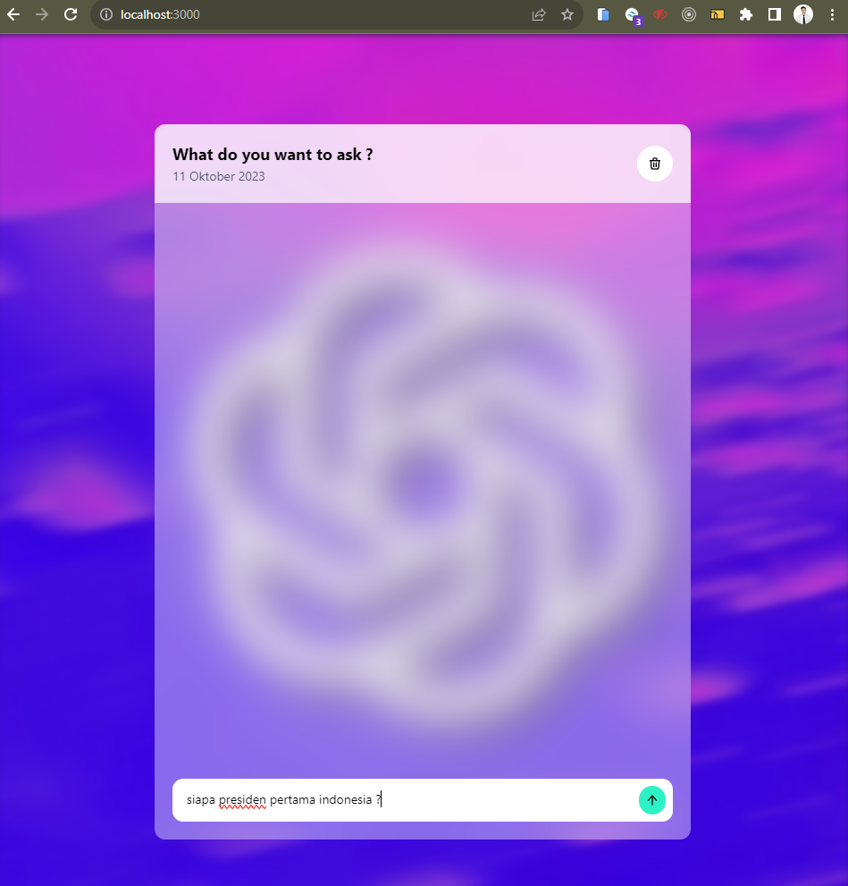
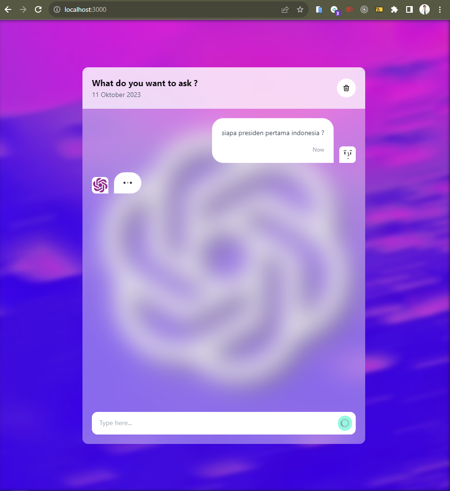
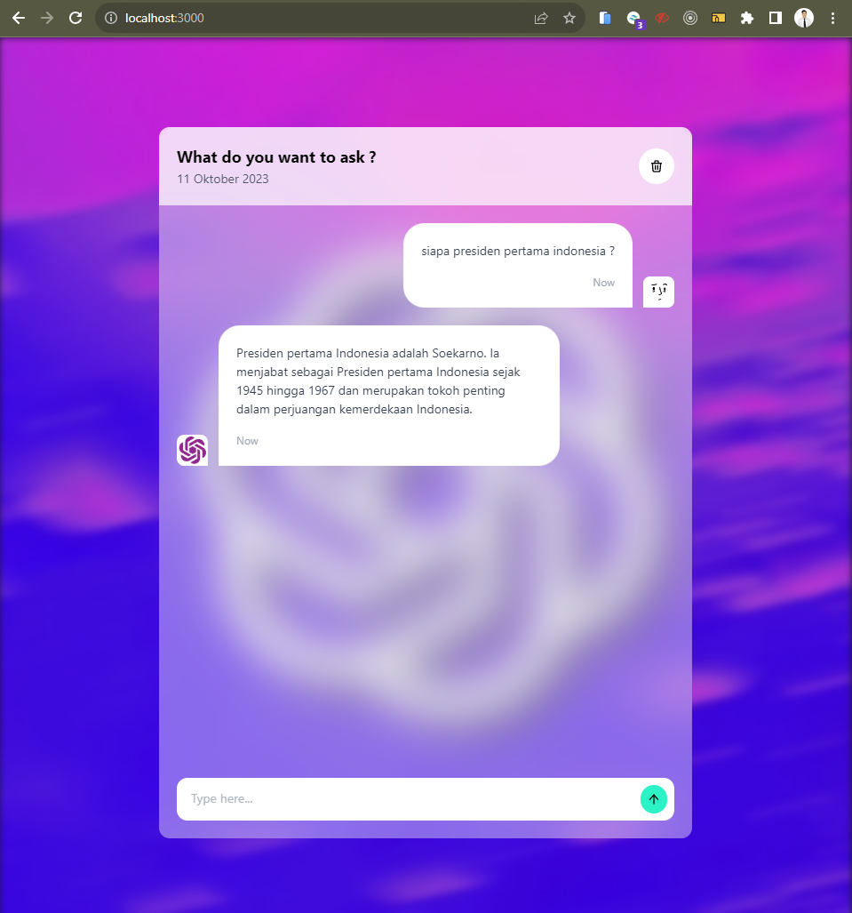
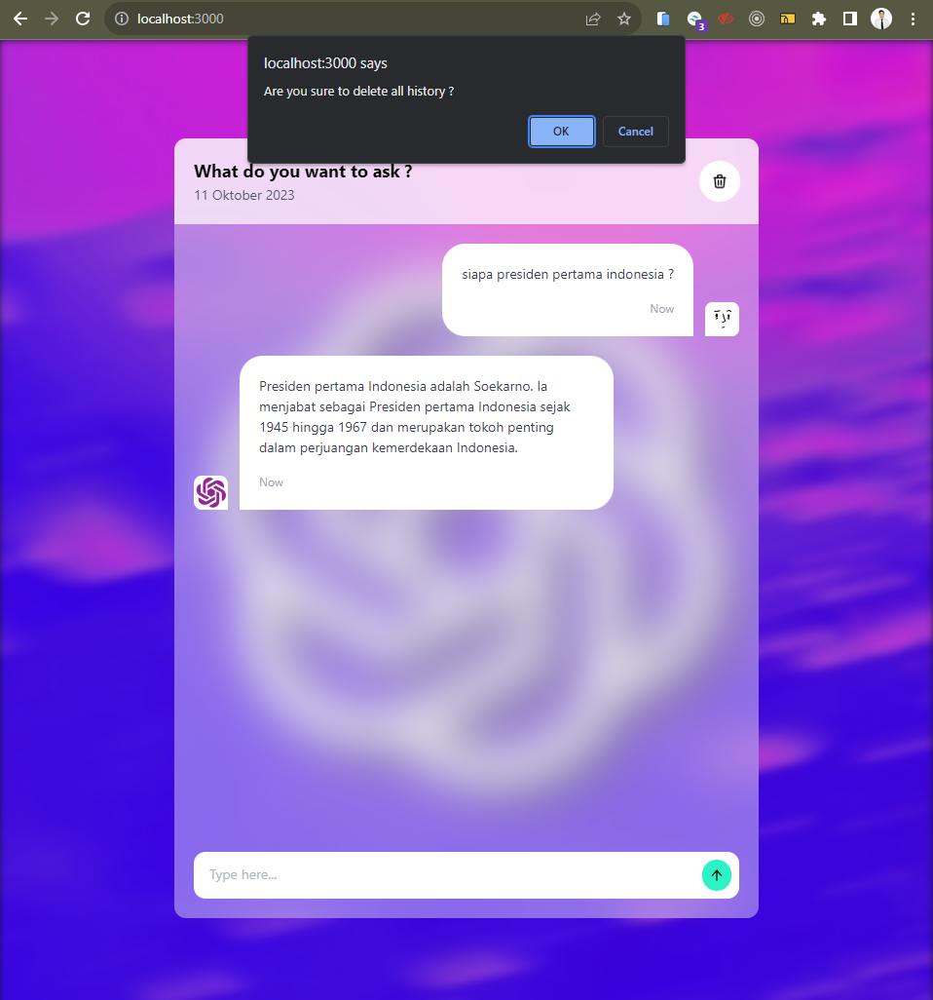

## Soal Prioritas 1 (70)

- Buatlah sebuah halaman baru yang terdapat form input dan button submit
- Hubungkan halaman tersebut dengan Open.ai sehingga ketika kita melakukan input akan dijawab oleh open.ai mode davinci 03

 

## Soal Prioritas 2 (30)

- Masukkan css atau interaksi lain yang menarik pada halaman sehingga mudah untuk digunakan
- Kalian boleh menambahkan fitur lain diluar dari soal dengan tujuan memudahkan user

 

- Result Screenshot : 

