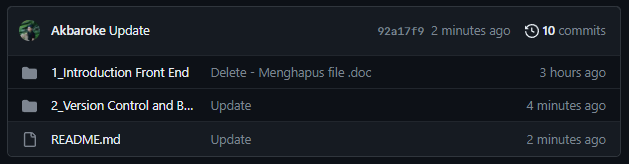
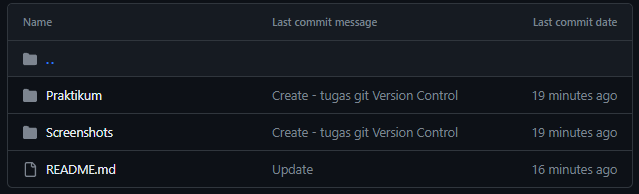
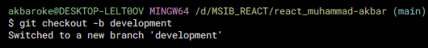
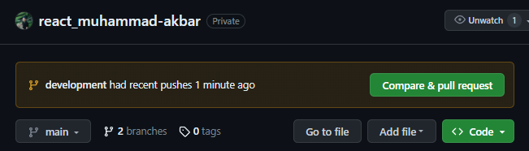
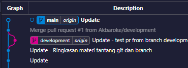

# Version Control and Branch Management (Git)
### Soal Prioritas 1 :
1. Buatlah sebuah repository github yang sesuai dengan `namaKelas_namaKlaian`  
Jawab :  

 

2. Buatlah folder yang berurutan dan diberi nama sesuai dengan nama soal yang kalian kerjakan  
Jawab :  

 

3. Pada setiap folder akan berisikan sub folder lagi  
Jawab :  

 

### Soal Prioritas 2 :
1. Buatlah branch baru pada github yang kalian buat   
Jawab :  

 

2. Lakukan Pull Request pada branch tersebut sehingga akan menambah hal baru pada branch `main/master`  
Jawab :  

 

### Soal Prioritas 3 :
1. Dengan project terserah kalian, praktikkan salah satu workflow serderhana dan buktikan dengan Screenshoot. `Github flow/gitflow/trunkbase`  
Jawab :  

