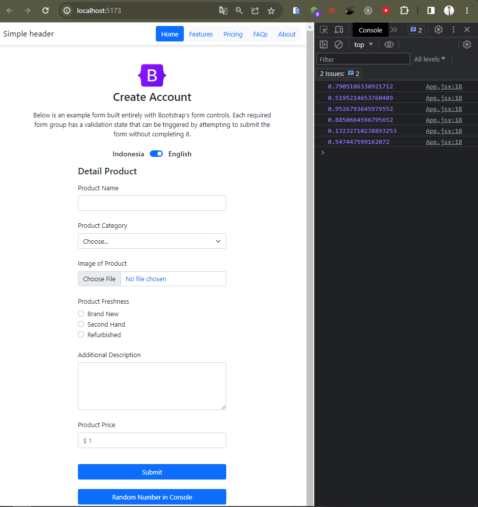
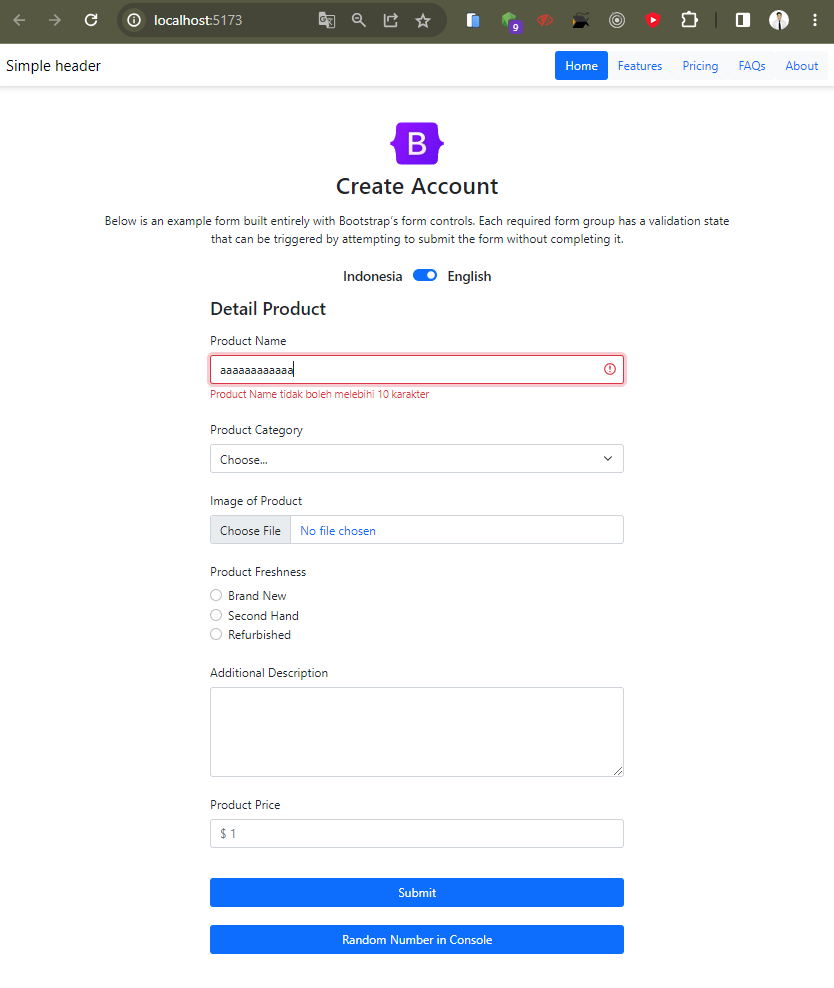
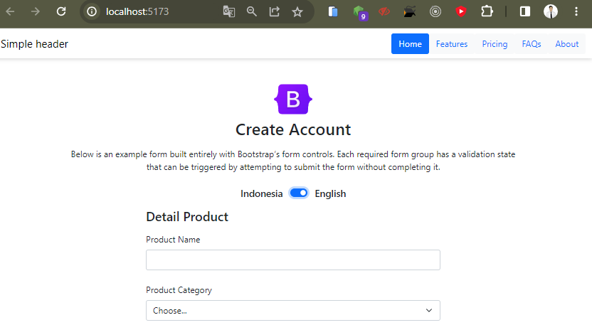
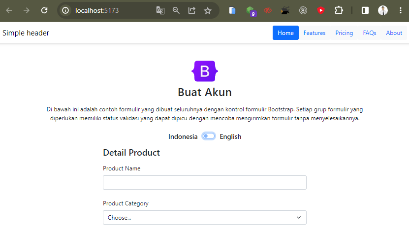

## Soal Prioritas 1 (80)

- Buatlah sebuah button dan terapkan event handling `onClick` pada salah satu tombol dihalaman `CreateProduct.jsx`. Jika tombol tersebut di-klik nantinya akan menampilkan `random number` di console.

<br>

- Buatlah sebuah file yang berisikan object berikut 

```js
const article = {
  title: {
    id: "Buat Akun",
    en: "Create Account"
  },
  description: {
    id: "Di bawah ini adalah contoh formulir yang dibuat seluruhnya dengan kontrol formulir Bootstrap. Setiap grup formulir yang diperlukan memiliki status validasi yang dapat dipicu dengan mencoba mengirimkan formulir tanpa menyelesaikannya.",
    en: "Below is an example form built entirely with Bootstrap’s form controls. Each required form group has a validation state that can be triggered by attempting to submit the form without completing it."
  }
};
```
<br>

- Result Screenshot :


<br>
<br>

## Soal Prioritas 2 (20)

- Gunakan event handling `onChange` untuk validasi value secara realtime yang dimasukan kedalam form input. Validasi ini meliputi :
  - `Product Name` tidak boleh melebihi 10 karakter

<br>

- Result Screenshot :



## Soal Explorasi (20)

- Pada halaman `CreateProduct.jsx` lakukan validasi seperti berikut
    - Jika salah satu field tidak valid/salah berikan border merah atau tampilkan icon error pada field tersebut dengan React Event Handling. (product freshness tidak harus memiliki validasi)

- Buatlah button untuk mengganti text pada halaman.
    - Buatlah sebuah button yang berfungsi mengganti bahasa yang digunakan pada halaman `CreateProduct.jsx` . Jika tombol itu di klik maka title dan deskripsi text pada halaman `CreateProduct.jsx` akan berubah menjadi text indonesia.
    - ketika kita menggunakan text indonesia dan melakukan klik pada button tersebut akan berganti menjadi text inggris.

<br>

- Result Screenshot :


